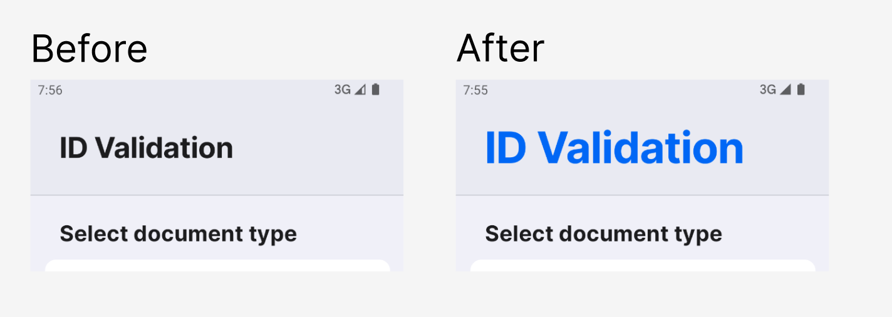
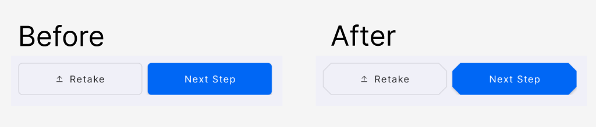
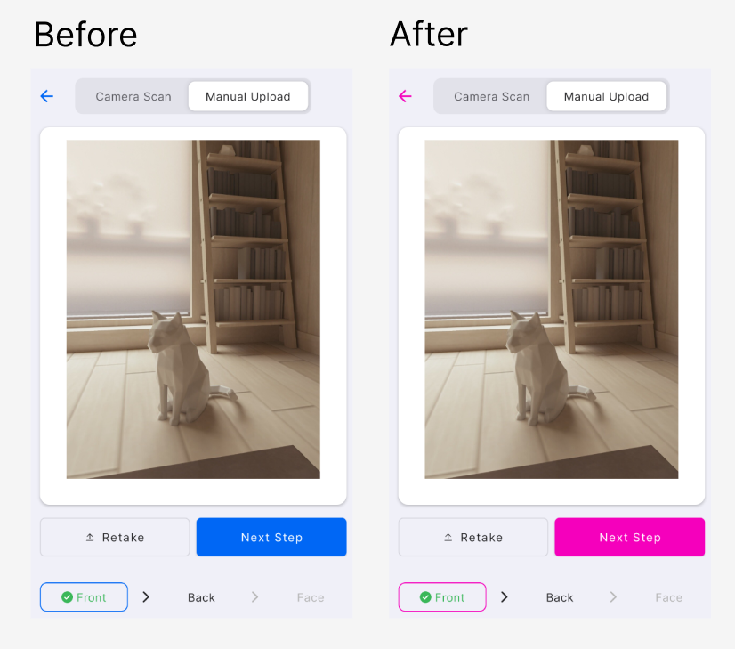
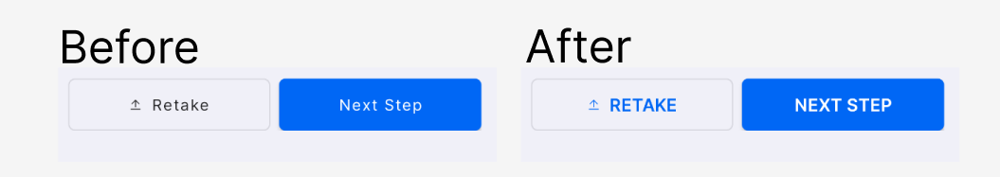
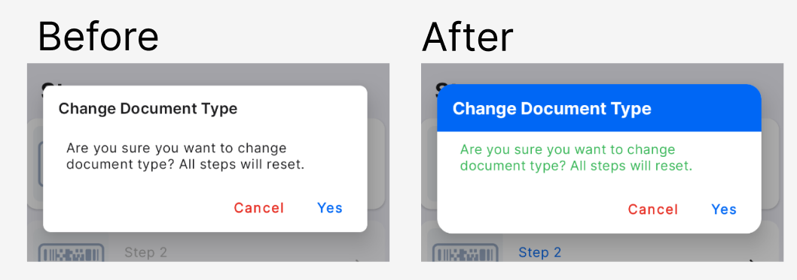
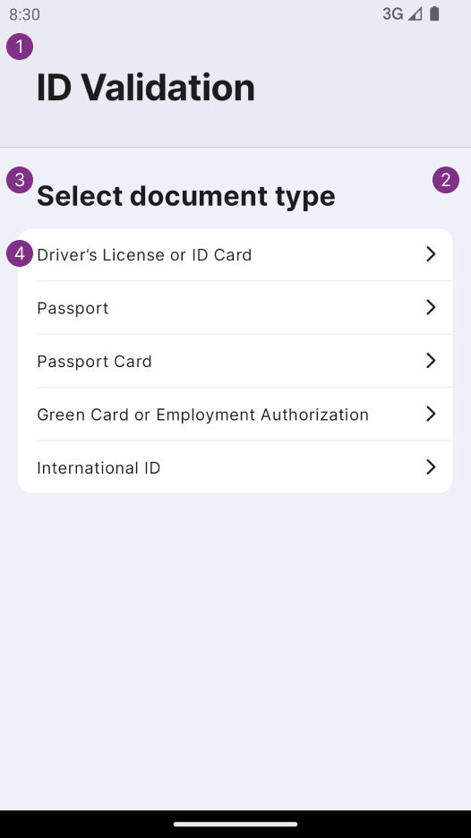
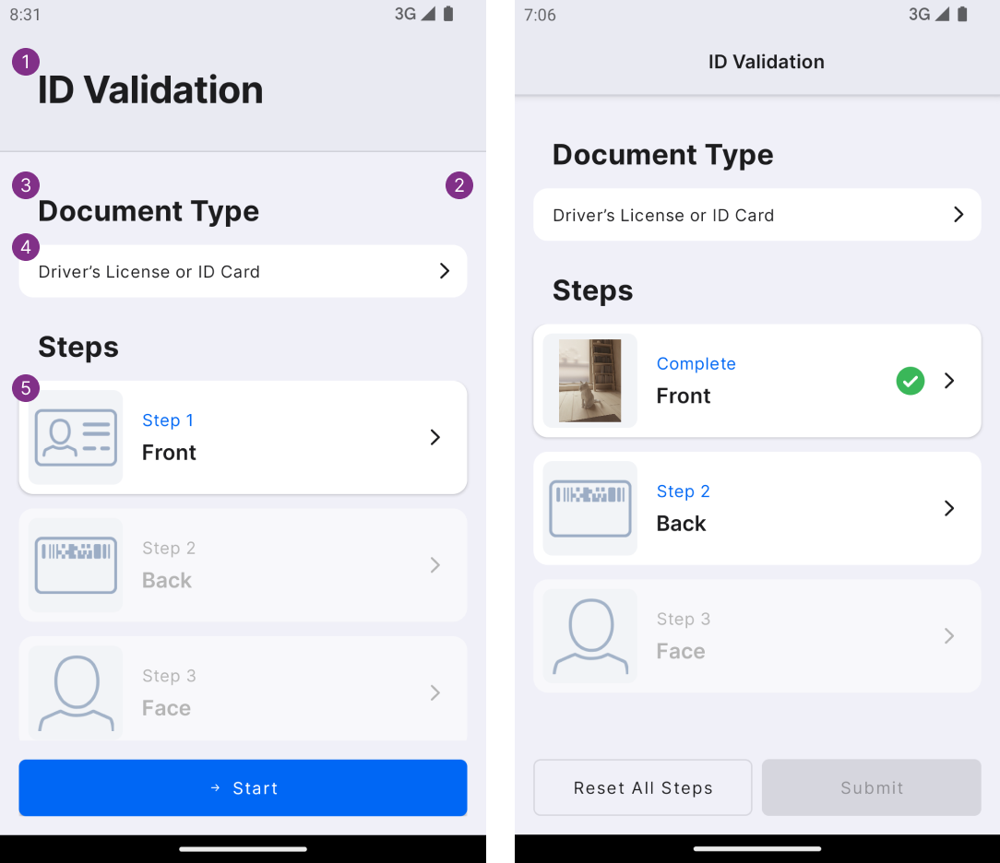
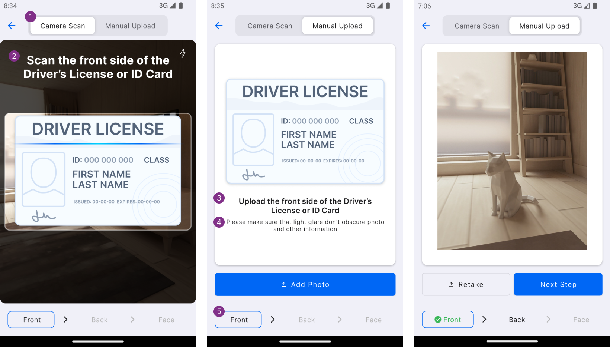
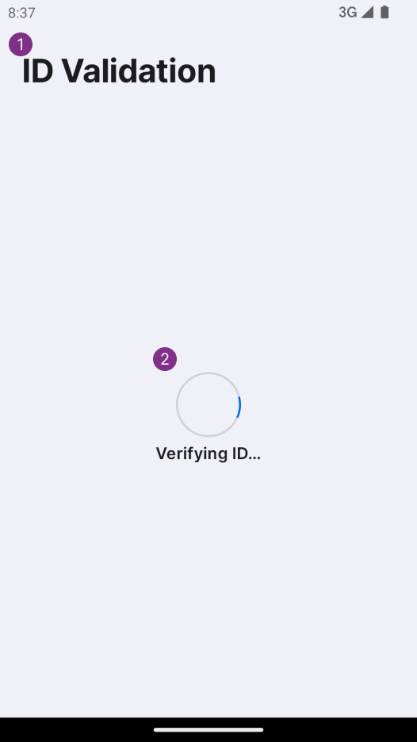

# DIVE SDK

## Setup

1. Add **idscan-public** maven repository to the **module** ```build.gradle.kts``` file:
    ```
    repositories {
        ...
        maven { url = uri("https://www.myget.org/F/idscan-public/maven/") }
    }
    ```
    or to the **project** ```settings.gradle``` file:
    ```
    dependencyResolutionManagement {
        ...
        repositories {
            ...
            maven { url = uri("https://www.myget.org/F/idscan-public/maven/") }
        }
    }
    ```
2. Add the following to the **module** ```build.gradle.kts``` file:
    ```
    dependencies {
        ...
        implementation("net.idscan.components.android:dvs:1.5.1")
        ...
    }
    ```

## Using

### Configuration of the Capture Pipeline 

---
For configuration of the capture pipeline you need to create a ```CaptureConfig``` object using **builder**.
It accepts required **LICENSE KEY** and provides additional methods for configuration of the pipeline.
**Note** that you need to replace **LICENSE KEY** by your License Key.
```
CaptureConfig captureConfig = CaptureConfig.builder("**LICENSE KEY**")
    // ...
    // Config the pipeline
    // ...
    .build();
```

#### Configuration Methods:

> ##### withHints(boolean enabled)
> Allows you to enable or disable animated hints before each capture step.
> 
> Default value is **False**.

> ##### withDocumentTypeSelector(boolean enabled)
> Show document type selector on the **Summary Screen**.
>
> Default value is **True**.

> ##### withAutoStart(boolean enabled)
> Allows you to start capture processing immediately without explicitly pressing the **Start** button on the **Summary Screen**.
>
> Default value is **False**.

> ##### withAutoSubmit(boolean enabled)
> Allows you to submit captured data immediately without explicitly pressing the **Submit** button on the **Summary Screen**.
>
> Default value is **False**.


> ##### withDocumentType(DocumentType type)
> Allows you to configure a capture pipeline for a specific type of document.
>
> **Supported types:** 
> * *DocumentType.DriverLicense*
> * *DocumentType.Passport*
> * *DocumentType.PassportCard*
> * *DocumentType.GreenCard*
> * *DocumentType.InternationalId*
>
> ```withDocumentType(DocumentType type)``` returns ```DocumentFlowConfig``` that can be used to configure
> a capture pipeline for a specific type of document:
> > ##### DocumentFlowConfig.withFront(boolean isUploadEnabled, boolean isCameraEnabled)
> > 
> > Allows you to configure rules for capturing the **front side** of the document. If **isUploadEnabled**
> > is true then a user will be able to upload an image of the front side from a file. If **isCameraEnabled** is 
> > true then a user will be able to use a camera for capturing the front side of the document. If **isUploadEnabled**
> > and **isCameraEnabled** both are false then the **front side** step is skipped.
> 
> > ##### DocumentFlowConfig.withBack(boolean isUploadEnabled, boolean isCameraEnabled)
> >
> > Allows you to configure rules for capturing the **back side** of the document. If **isUploadEnabled**
> > is true then a user is able to upload an image of the back side from a file. If **isCameraEnabled** is
> > true then a user is able to use a camera for capturing the back side of the document. If **isUploadEnabled**
> > and **isCameraEnabled** both are false then the **back side** step is skipped.
>
> > ##### DocumentFlowConfig withFace(boolean isUploadEnabled, boolean isCameraEnabled, boolean checkRealFace)
> >
> > Allows you to configure rules for capturing **face**. If **isUploadEnabled**
> > is true then a user is able to upload an image of the face from a file. If **isCameraEnabled** is
> > true then a user is able to use a camera for capturing the face. If **isUploadEnabled**
> > and **isCameraEnabled** both are false then the **face capturing** step is skipped. If **checkRealFace**
> > and **isCameraEnabled** both are true then the **Real Face Checking** procedure is executed during the face
> > capture.
>
> Each block that starts with ```withDocumentType(DocumentType type)``` should be completed with a ```.complete()``` call.
> If there are no ```withDocumentType()``` blocks that are specified then all document types with all steps are used by default.

#### Example of the capture pipeline configuration:
```
CaptureConfig captureConfig = CaptureConfig.builder("**LICENSE_KEY**")
    .withHints(true)
    .withDocumentTypeSelector(false)
    .withAutoStart(true)
    .withAutoSubmit(true)
    .withDocumentType(DocumentType.DriverLicense)
        .withBack(true, true)
        .withFront(true, true)
        .withFace(true, true, true)
        .complete()
    .withDocumentType(DocumentType.Passport)
        .withBack(true, true)
        .withFront(true, true)
        .withFace(true, true, true)
        .complete()
    .build();
```
**Note** that each ```withDocumentType(...)``` block should be completed with a ```.complete()``` call.

### Configuration of the Verification Service

---
To configure the Verification Service you need to create a ```VerificationConfig``` object. It contains optional
fields you can use to override the verification options defined on the portal. Portal
settings will be applied for undefined fields.
```
VerificationConfig verificationConfig = new VerificationConfig();
verificationConfig.isOCREnabled = ...;
verificationConfig.faceVerification = ...;
...
```

#### VerificationConfig fields:
* ```isOCREnabled``` - a setting that enables processing of the front image of a document using the OCR technology
* ```isAddressCheckEnabled``` - a setting enabling the verification of the address found on the submitted 
document by using a third party address verification web service
* ```isCrossMatchRequired``` - this setting is making it a requirement that both the front and the back of 
the document are able to be read successfully. When this setting is disabled a submission will be considered
successful if either the front or the back of the document can be read
* ```isDMVEnabled``` - a setting enabling only the DMV check to be run (when both sides of a document 
can be processed successfully) verifying that the data on the Driver licenses, driving permits or ID 
cards matches the data held by the jurisdiction that issued the document
* ```isDMVPartialEnabled``` - a setting for a case when only a DMV check will be run after
overriddenSettings.isCrossMatchRequired is set to false and only one side of a document can be processed successfully
* ```isIdentiFraudEnabled``` - a setting for a case when only Identifraud check will be run after
overriddenSettings.isCrossMatchRequired is set to false and only one side of a document can be processed successfully
* ```isIdentiFraudFullCaseEnabled``` - a setting enabling only the Identifraud check to be run when both sides 
of a document can be processed successfully
* ```isDmvOrIdentiFraudEnabled``` - this setting is used to configure that when both sides of a document can be 
processed successfully a DMV check is run where possible, if it is not possible then an Identifraud check
is run
* ```isDmvAndIdentiFraudEnabled``` - both DMV and Identifraud checks are run when both sides of a document
can be processed successfully
* ```isDmvOrIdentiFraudPartialEnabled``` - a DMV check is run where possible, if it is not possible then 
an Identifraud check is run when overriddenSettings.isCrossMatchRequired is set to false and only one
side of a document can be processed successfully
* ```isDmvAndIdentiFraudPartialEnabled``` - both DMV and Identifraud checks are run when
overriddenSettings.isCrossMatchRequired is set to false and only one side of a document can be processed successfully
* ```isFaceRequiredOnDocument``` - this setting makes it optional to perform a face match if for some reason a 
cropped image of the document owner's face from the front image of the document cannot be obtained
* ```faceVerification``` - a setting that enables performing a face match between a submitted selfie and a cropped image of the
document owner's face from the front image of the document

#### Example of the Verification Service configuration:
```
VerificationConfig verificationConfig = new VerificationConfig();
verificationConfig.isOCREnabled = false;
verificationConfig.isAddressCheckEnabled = true;
```

### Configuration of the Verification mode

---
There are two options of how your application can get the verification result:
* ```VerificationMode.Local``` - in this mode the verification result is processed directly by your application.
* ```VerificationMode.Server``` - in this mode the application just create a request for the verification 
and get back a request key that can be passed to the 3rd party server. In this case the 3rd 
party server is responsible for requesting the verification result.


### Configuration of the DIVE Fragment

---
```CaptureConfig``` and ```VerificationConfig``` are used in ```DvsConfig.Builder``` for configuration the DvsFragment
object. ```DvsConfig.Builder``` accepts the required **Authorization Token**, **VerificationConfig**, **CaptureConfig**
and **VerificationMode** parameters and provides additional methods for configuration of the DIVE fragment.
Authenticating requests to the **DIVE API** are done using the public key/secret key as a Bearer token in the
Authorization Header. This key should be defined by the **authorizationToken** parameter.
```
DvsConfig config = new DvsConfig.Builder(authorizationToken, captureConfig, verificationConfig, verificationMode)
    .withCustomUrl(...)
    .withCustomUserAgent(...)
    .build();
```

#### Configuration Methods:

> ##### DvsConfig.Builder.withCustomUserAgent(String userAgent)
> Allows you to configure the **user-agent** header in an HTTP request.
>
> Default value is **Android**.

> ##### DvsConfig.Builder.withCustomUrl(String url)
> Allows you to redefine a DIVE API endpoint.
>
> Default value is **https://dvs2.idware.net/api/v3**.

### Show DIVE fragment

---
```DvsFragment.newInstance(config)``` accepts the ```DvsConfig``` parameter and returns the instance of DIVE fragment that can
be used with android **[FragmentManager](https://developer.android.com/guide/fragments/fragmentmanager#java)** 
in a typical way. 
```
Fragment fragment = DvsFragment.newInstance(config);
getSupportFragmentManager()
    .beginTransaction()
    .setPrimaryNavigationFragment(fragment)
    .replace(R.id.fragment_container_view, fragment, "DvsFragment")
    .addToBackStack("DvsFragment")
    .commit();
```
**Note** that we use ```.setPrimaryNavigationFragment(fragment)``` here to give ```DvsFragment``` a chance to process 
**back stack** navigation before the parent fragment manager.

### Processing result

#### For Server Verification Mode

---
```DvsFragment``` provides a useful ```setFragmentResultListener``` method that allows you get the result of the verification in
a convenient way.
```
DvsFragment {
    public interface RequestCallback {
        void onRequest(@NonNull VerificationRequest var1);
    }
    
    public interface ErrorCallback {
        void onError(@NonNull DvsException error);
    }
    ...
    
    public static void setFragmentResultListener(
            @NonNull FragmentManager fragmentManager,
            @NonNull LifecycleOwner lifecycleOwner,
            @NonNull RequestCallback requestCallback,
            @NonNull ErrorCallback errorCallback
    ) {
        ...
    } 
}
```
Under the hood ```setFragmentResultListener``` uses
[ Fragment Result API](https://developer.android.com/guide/fragments/communicate#fragment-result)
and accepts ```RequestCallback``` and  ```ErrorCallback``` callbacks to process the result of the verification.

#### Example of using the DIVE fragment:
```
public class MainActivity extends AppCompatActivity {
    @Override
    public void onCreate(@Nullable Bundle savedInstanceState) {
        super.onCreate(savedInstanceState);
        setContentView(R.layout.main_activity);

        // Setup result listener.
        DvsFragment.setFragmentResultListener(
                getSupportFragmentManager(),
                this,
                this::showDvsRequestFragment,
                this::showDvsErrorFragment
        );
        
        // Prepare config.
        CaptureConfig captureConfig = CaptureConfig.builder("**LICENSE_KEY**").build();
        VerificationConfig verificationConfig = new VerificationConfig();
        DvsConfig config = new DvsConfig.Builder(
            "Authorization Token",
            captureConfig,
            verificationConfig,
            VerificationMode.Server
        ).build();
        
        // Show fragment.
        showDvsFragment(config);
    }

    private void showDvsFragment(@NonNull DvsConfig config) {
        FragmentManager fm = getSupportFragmentManager();
        if (fm.findFragmentByTag("DvsFragment") == null) {
            Fragment fragment = DvsFragment.newInstance(config);
            getSupportFragmentManager()
                    .beginTransaction()
                    .setPrimaryNavigationFragment(fragment)
                    .replace(R.id.fragment_container_view, fragment, "DvsFragment")
                    .addToBackStack("DvsFragment")
                    .commit();
        }
    }

    private void showDvsRequestFragment(@NonNull VerificationRequest result) {
        // Process the result.
    }

    private void showDvsErrorFragment(@NonNull DvsException error) {
        // Process the error.
    }
}
```
#### For Local Verification Mode

---
```DvsFragment``` provides a useful ```setFragmentResultListener``` method that allows you get the result of the verification in
a convenient way.
```
DvsFragment {
    public interface SuccessCallback {
        void onSuccess(@NonNull VerificationResult result);
    }
    
    public interface ErrorCallback {
        void onError(@NonNull DvsException error);
    }
    ...
    
    public static void setFragmentResultListener(
            @NonNull FragmentManager fragmentManager,
            @NonNull LifecycleOwner lifecycleOwner,
            @NonNull SuccessCallback successCallback,
            @NonNull ErrorCallback errorCallback
    ) {
        ...
    } 
}
```
Under the hood ```setFragmentResultListener``` uses
[ Fragment Result API](https://developer.android.com/guide/fragments/communicate#fragment-result) 
and accepts ```SuccessCallback``` and  ```ErrorCallback``` callbacks to process the result of the verification.

#### Example of using the DIVE fragment:
```
public class MainActivity extends AppCompatActivity {
    @Override
    public void onCreate(@Nullable Bundle savedInstanceState) {
        super.onCreate(savedInstanceState);
        setContentView(R.layout.main_activity);

        // Setup result listener.
        DvsFragment.setFragmentResultListener(
                getSupportFragmentManager(),
                this,
                this::showDvsResultFragment,
                this::showDvsErrorFragment
        );
        
        // Prepare config.
        CaptureConfig captureConfig = CaptureConfig.builder("**LICENSE_KEY**").build();
        VerificationConfig verificationConfig = new VerificationConfig();
        DvsConfig config = new DvsConfig.Builder(
            "Authorization Token",
            captureConfig,
            verificationConfig,
            VerificationMode.Client
        ).build();
        
        // Show fragment.
        showDvsFragment(config);
    }

    private void showDvsFragment(@NonNull DvsConfig config) {
        FragmentManager fm = getSupportFragmentManager();
        if (fm.findFragmentByTag("DvsFragment") == null) {
            Fragment fragment = DvsFragment.newInstance(config);
            getSupportFragmentManager()
                    .beginTransaction()
                    .setPrimaryNavigationFragment(fragment)
                    .replace(R.id.fragment_container_view, fragment, "DvsFragment")
                    .addToBackStack("DvsFragment")
                    .commit();
        }
    }

    private void showDvsResultFragment(@NonNull VerificationResult result) {
        // Process the result.
    }

    private void showDvsErrorFragment(@NonNull DvsException error) {
        // Process the error.
    }
}
```

## Customization

UI representation of the DIVE fragment is based on the Material Design 2 and can be customized using a theme. The DIVE SDK provides a
basic ```Theme.DVS``` theme that can be extended to customize the UI.

### Typography

---
DIVE SDK typography is based on the Material Design. 
```
<?xml version="1.0" encoding="utf-8"?>
<resources>
    <style name="TextAppearance.DVS.Headline1" parent="TextAppearance.MaterialComponents.Headline1">
        <item name="android:textColor">?colorOnSurface</item>
        <item name="android:fontFamily">@font/inter_bold</item>
        <item name="fontFamily">@font/inter_bold</item>
        <item name="android:textSize">32sp</item>
    </style>

    <style name="TextAppearance.DVS.Headline2" parent="TextAppearance.MaterialComponents.Headline2">
        <item name="android:textColor">?colorOnSurface</item>
        <item name="android:fontFamily">@font/inter_bold</item>
        <item name="fontFamily">@font/inter_bold</item>
        <item name="android:textSize">32sp</item>
    </style>

    <style name="TextAppearance.DVS.Headline3" parent="TextAppearance.MaterialComponents.Headline3">
        <item name="android:textColor">?colorOnSurface</item>
        <item name="android:fontFamily">@font/inter_bold</item>
        <item name="fontFamily">@font/inter_bold</item>
        <item name="android:textSize">28sp</item>
    </style>

    <style name="TextAppearance.DVS.Headline4" parent="TextAppearance.MaterialComponents.Headline4">
        <item name="android:textColor">?colorOnSurface</item>
        <item name="android:fontFamily">@font/inter_bold</item>
        <item name="fontFamily">@font/inter_bold</item>
        <item name="android:textSize">24sp</item>
    </style>

    <style name="TextAppearance.DVS.Headline5" parent="TextAppearance.MaterialComponents.Headline5">
        <item name="android:textColor">?colorOnSurface</item>
        <item name="android:fontFamily">@font/inter_semi_bold</item>
        <item name="fontFamily">@font/inter_semi_bold</item>
        <item name="android:textSize">18sp</item>
    </style>

    <style name="TextAppearance.DVS.Headline6" parent="TextAppearance.MaterialComponents.Headline6">
        <item name="android:textColor">?colorOnSurface</item>
        <item name="android:fontFamily">@font/inter_semi_bold</item>
        <item name="fontFamily">@font/inter_semi_bold</item>
        <item name="android:textSize">16sp</item>
    </style>

    <style name="TextAppearance.DVS.Body1" parent="TextAppearance.MaterialComponents.Body1">
        <item name="android:textColor">?colorOnSurface</item>
        <item name="android:fontFamily">@font/inter_regular</item>
        <item name="fontFamily">@font/inter_regular</item>
        <item name="android:textSize">14sp</item>
    </style>

    <style name="TextAppearance.DVS.Button" parent="TextAppearance.MaterialComponents.Button">
        <item name="android:textColor">?colorOnSurface</item>
        <item name="android:fontFamily">@font/inter_regular</item>
        <item name="fontFamily">@font/inter_regular</item>
        <item name="android:textSize">14sp</item>
    </style>

    <style name="TextAppearance.DVS.Caption" parent="TextAppearance.MaterialComponents.Caption">
        <item name="android:textColor">?colorOnSurface</item>
        <item name="android:fontFamily">@font/inter_regular</item>
        <item name="fontFamily">@font/inter_regular</item>
        <item name="android:textSize">12sp</item>
    </style>

    <style name="TextAppearance.DVS.Subtitle1" parent="TextAppearance.MaterialComponents.Subtitle1">
        <item name="android:textColor">?colorOnSurface</item>
        <item name="android:fontFamily">@font/inter_semi_bold</item>
        <item name="fontFamily">@font/inter_semi_bold</item>
        <item name="android:textSize">16sp</item>
    </style>

    <style name="TextAppearance.DVS.Body2" parent="TextAppearance.MaterialComponents.Body2">
        <item name="android:fontFamily">@font/inter_regular</item>
        <item name="fontFamily">@font/inter_regular</item>
        <item name="android:textSize">14sp</item>
    </style>


    <style name="TextAppearance.DVS.Subtitle2" parent="TextAppearance.MaterialComponents.Subtitle2">
        <item name="android:fontFamily">@font/inter</item>
        <item name="fontFamily">@font/inter</item>
    </style>

    <style name="TextAppearance.DVS.Overline" parent="TextAppearance.MaterialComponents.Overline">
        <item name="android:fontFamily">@font/inter</item>
        <item name="fontFamily">@font/inter</item>
    </style>

    <style name="Theme.DVS" parent="Theme.MaterialComponents.Light.NoActionBar">
        ...
        <item name="textAppearanceHeadline1">@style/TextAppearance.DVS.Headline1</item>
        <item name="textAppearanceHeadline2">@style/TextAppearance.DVS.Headline2</item>
        <item name="textAppearanceHeadline3">@style/TextAppearance.DVS.Headline3</item>
        <item name="textAppearanceHeadline4">@style/TextAppearance.DVS.Headline4</item>
        <item name="textAppearanceHeadline5">@style/TextAppearance.DVS.Headline5</item>
        <item name="textAppearanceHeadline6">@style/TextAppearance.DVS.Headline6</item>
        <item name="textAppearanceSubtitle1">@style/TextAppearance.DVS.Subtitle1</item>
        <item name="textAppearanceSubtitle2">@style/TextAppearance.DVS.Subtitle2</item>
        <item name="textAppearanceBody1">@style/TextAppearance.DVS.Body1</item>
        <item name="textAppearanceBody2">@style/TextAppearance.DVS.Body2</item>
        <item name="textAppearanceButton">@style/TextAppearance.DVS.Button</item>
        <item name="textAppearanceCaption">@style/TextAppearance.DVS.Caption</item>
        <item name="textAppearanceOverline">@style/TextAppearance.DVS.Overline</item>
        ...
    </style>
</resources>
```
These styles can be redefined in the custom theme or it can be used in your application theme.

#### Example of a redefined text style
```
<resources xmlns:tools="http://schemas.android.com/tools">
    ...
    <style name="TextAppearance.CustomDiveTheme.Headline1" parent="TextAppearance.DVS.Headline1">
        <item name="android:textColor">?colorPrimary</item>
        <item name="android:textSize">48sp</item>
    </style>
    ...
    <style name="Theme.CustomDiveTheme" parent="Theme.DVS">
        ...
        <item name="textAppearanceHeadline1">@style/TextAppearance.CustomDiveTheme.Headline1</item>
        ...
    </style>
    ...
</resources>
```


### Shapes

---
DIVE SDK shapes are based on the Material Design.
```
<?xml version="1.0" encoding="utf-8"?>
<resources>
    ...
    <style name="ShapeAppearance.DVS.SmallComponent" parent="ShapeAppearance.MaterialComponents.SmallComponent">
        <item name="cornerSize">6dp</item>
    </style>

    <style name="ShapeAppearance.DVS.MediumComponent" parent="ShapeAppearance.MaterialComponents.MediumComponent">
        <item name="cornerSize">8dp</item>
    </style>

    <style name="ShapeAppearance.DVS.LargeComponent" parent="ShapeAppearance.MaterialComponents.LargeComponent">
        <item name="cornerSize">12dp</item>
    </style>
    ...
    <style name="Theme.DVS" parent="Theme.MaterialComponents.Light.NoActionBar">
        ...
        <item name="shapeAppearanceSmallComponent">@style/ShapeAppearance.DVS.SmallComponent</item>
        <item name="shapeAppearanceMediumComponent">@style/ShapeAppearance.DVS.MediumComponent</item>
        <item name="shapeAppearanceLargeComponent">@style/ShapeAppearance.DVS.LargeComponent</item>
        ...
    </style>
</resources>
```
These styles can be redefined in the custom theme or it can be used in your application theme.

#### Example of redefining shapes
```
<resources xmlns:tools="http://schemas.android.com/tools">
    ...
    <style name="ShapeAppearance.CustomDiveTheme.SmallComponent" parent="ShapeAppearance.DVS.SmallComponent">
        <item name="cornerSize">12dp</item>
        <item name="cornerFamily">cut</item>
    </style>
    ...
    <style name="Theme.CustomDiveTheme" parent="Theme.DVS">
        <item name="shapeAppearanceSmallComponent">@style/ShapeAppearance.CustomDiveTheme.SmallComponent</item>
    </style>
    ...
</resources>
```



### Colors

---
DIVE SDK colors are based on Material Design colors. You can redefine them in the custom theme to adapt the UI to your branding.

#### Example of redefining colors
```
<resources xmlns:tools="http://schemas.android.com/tools">
    ...
    <style name="Theme.CustomDiveTheme" parent="Theme.DVS">
        ...
        <item name="colorPrimary">#F500BC</item>
        ...
    </style>
    ...
</resources>
```


### Buttons

---
Style of DIVE SDK buttons is based on **Material Button** and **Outlined Material Button**.
```
<?xml version="1.0" encoding="utf-8"?>
<resources>
    ...
    <style name="Widget.DVS.MaterialButton" parent="Widget.MaterialComponents.Button">
        <item name="android:insetTop">0dp</item>
        <item name="android:insetBottom">0dp</item>
        <item name="android:insetLeft">0dp</item>
        <item name="android:insetRight">0dp</item>
        <item name="iconPadding">8dp</item>
        <item name="iconSize">12dp</item>
        <item name="android:textAllCaps">false</item>
    </style>

    <style name="Widget.DVS.OutlinedMaterialButton" parent="Widget.MaterialComponents.Button.OutlinedButton">
        <item name="android:insetTop">0dp</item>
        <item name="android:insetBottom">0dp</item>
        <item name="android:insetLeft">0dp</item>
        <item name="android:insetRight">0dp</item>
        <item name="iconPadding">8dp</item>
        <item name="iconSize">12dp</item>
        <item name="android:textAllCaps">false</item>
        <item name="android:textColor">?colorOnSurface</item>
        <item name="iconTint">?colorOnSurface</item>
    </style>
    ...
    <style name="Theme.DVS" parent="Theme.MaterialComponents.Light.NoActionBar">
        ...
        <item name="materialButtonStyle">@style/Widget.DVS.MaterialButton</item>
        <item name="materialButtonOutlinedStyle">@style/Widget.DVS.OutlinedMaterialButton</item>
        ...
    </style>
    ...
</resources>
```
You can redefine this styles in custom theme or use it in your application theme.

#### Example of redefining the style of buttons
```
<resources xmlns:tools="http://schemas.android.com/tools">
    ...
    <style name="Widget.CustomDiveTheme.MaterialButton" parent="Widget.DVS.MaterialButton">
        <item name="android:textAllCaps">true</item>
        <item name="android:textAppearance">?attr/textAppearanceSubtitle1</item>
    </style>
    
    <style name="Widget.CustomDiveTheme.OutlinedMaterialButton" parent="Widget.DVS.OutlinedMaterialButton">
        <item name="android:textAllCaps">true</item>
        <item name="android:textColor">?colorPrimary</item>
        <item name="iconTint">?colorPrimary</item>
        <item name="android:textAppearance">?attr/textAppearanceSubtitle1</item>
    </style>
    ...
    <style name="Theme.CustomDiveTheme" parent="Theme.DVS">
        ...
        <item name="materialButtonStyle">@style/Widget.CustomDiveTheme.MaterialButton</item>
        <item name="materialButtonOutlinedStyle">@style/Widget.CustomDiveTheme.OutlinedMaterialButton</item>
        ...
    </style>
    ...
</resources>
```


### Dialogs

---
The Style of the DIVE SDK Dialogs is based on **MaterialAlertDialog**
```
<resources>
    <style name="Theme.DVS" parent="Theme.MaterialComponents.Light.NoActionBar">
        ...
        <item name="dialogCornerRadius">8dp</item>
        <item name="materialAlertDialogTheme">@style/ThemeOverlay.DVS.AlertDialog</item>
        <item name="dialogTheme">@style/ThemeOverlay.DVS.AlertDialog</item>
        ...
    </style>
    ...
    <style name="ThemeOverlay.DVS.AlertDialog" parent="ThemeOverlay.MaterialComponents.MaterialAlertDialog">
        <item name="materialAlertDialogTitlePanelStyle">@style/Widget.DVS.AlertDialog.Title.Panel</item>
        <item name="materialAlertDialogTitleTextStyle">@style/Widget.DVS.AlertDialog.Title.Text</item>
        <item name="materialAlertDialogBodyTextStyle">@style/Widget.DVS.AlertDialog.Body.Text</item>
        <item name="buttonBarPositiveButtonStyle">@style/Widget.DVS.AlertDialog.Button.Positive</item>
        <item name="buttonBarNeutralButtonStyle">@style/Widget.DVS.AlertDialog.Button.Positive</item>
        <item name="buttonBarNegativeButtonStyle">@style/Widget.DVS.AlertDialog.Button.Negative</item>
        <item name="android:dividerHeight">1dp</item>
        <item name="listDividerAlertDialog">@drawable/dvs_common_divider</item>
        <item name="android:listDivider">@drawable/dvs_common_divider</item>
        <item name="shapeAppearanceOverlay">@style/ShapeAppearance.DVS.Dialog</item>
        <item name="listPreferredItemHeightSmall">48dp</item>
        <item name="textAppearanceListItem">?textAppearanceBody1</item>
        <item name="textAppearanceListItemSecondary">?textAppearanceBody1</item>
        <item name="textAppearanceListItemSmall">?textAppearanceBody1</item>
    </style>
    ...
    <style name="Widget.DVS.Dialog.Title" parent="">
        <item name="android:textAppearance">?textAppearanceHeadline4</item>
        <item name="android:textColor">?colorOnPrimary</item>
        <item name="android:background">?colorPrimary</item>
        <item name="android:paddingLeft">16dp</item>
        <item name="android:paddingRight">16dp</item>
        <item name="android:paddingTop">24dp</item>
        <item name="android:paddingBottom">24dp</item>
    </style>

    <style name="Widget.DVS.Dialog.Button" parent="Widget.MaterialComponents.Button.OutlinedButton">
        <item name="android:insetTop">0dp</item>
        <item name="android:insetBottom">0dp</item>
        <item name="android:insetRight">0dp</item>
        <item name="android:insetLeft">0dp</item>
        <item name="strokeWidth">0dp</item>
        <item name="android:maxLines">1</item>
        <item name="android:textAppearance">?textAppearanceButton</item>
    </style>

    <style name="Widget.DVS.Dialog.Button.Positive">
        <item name="shapeAppearanceOverlay">@style/ShapeAppearance.DVS.Dialog.Button.Positive</item>
    </style>

    <style name="Widget.DVS.Dialog.Button.Negative">
        <item name="shapeAppearanceOverlay">@style/ShapeAppearance.DVS.Dialog.Button.Negative</item>
    </style>

    <style name="Widget.DVS.AlertDialog.Title.Panel" parent="MaterialAlertDialog.MaterialComponents.Title.Panel">
        <item name="android:background">@null</item>
        <item name="android:paddingLeft">16dp</item>
        <item name="android:paddingRight">16dp</item>
        <item name="android:paddingTop">12dp</item>
        <item name="android:paddingBottom">12dp</item>
    </style>

    <style name="Widget.DVS.AlertDialog.Title.Text" parent="MaterialAlertDialog.MaterialComponents.Title.Text">
        <item name="android:textAppearance">?textAppearanceSubtitle1</item>
        <item name="android:textColor">?colorOnSurface</item>
        <item name="android:textStyle">bold</item>
    </style>

    <style name="Widget.DVS.AlertDialog.Body.Text" parent="">
        <item name="android:textAppearance">?textAppearanceBody1</item>
        <item name="android:textColor">?colorOnSurface</item>
    </style>

    <style name="Widget.DVS.AlertDialog.Button" parent="Widget.MaterialComponents.Button.TextButton.Dialog">
        <item name="shapeAppearance">@style/ShapeAppearance.DVS.SmallComponent</item>
        <item name="android:textStyle">bold</item>
    </style>

    <style name="Widget.DVS.AlertDialog.Button.Positive">
        <item name="android:textColor">?colorPrimary</item>
    </style>

    <style name="Widget.DVS.AlertDialog.Button.Negative">
        <item name="android:textColor">?colorError</item>
    </style>
</resources>
```
You can redefine these styles within the custom theme or use them in your application theme.

#### Example of redefining the style of Dialogs
```
<resources xmlns:tools="http://schemas.android.com/tools">
    ...
    <style name="Widget.CustomDiveTheme.AlertDialog.Title.Panel" parent="Widget.DVS.AlertDialog.Title.Panel">
        <item name="android:background">?colorPrimary</item>
    </style>

    <style name="Widget.CustomDiveTheme.AlertDialog.Title.Text" parent="Widget.DVS.AlertDialog.Title.Text">
        <item name="android:textAppearance">?textAppearanceHeadline3</item>
        <item name="android:textColor">?colorOnPrimary</item>
    </style>

    <style name="Widget.CustomDiveTheme.AlertDialog.Body.Text" parent="Widget.DVS.AlertDialog.Body.Text">
        <item name="android:textAppearance">?textAppearanceBody2</item>
        <item name="android:textColor">?colorAccent</item>
    </style>

    <style name="ThemeOverlay.CustomDiveTheme.AlertDialog" parent="ThemeOverlay.DVS.AlertDialog">
        <item name="materialAlertDialogTitlePanelStyle">@style/Widget.CustomDiveTheme.AlertDialog.Title.Panel</item>
        <item name="materialAlertDialogTitleTextStyle">@style/Widget.CustomDiveTheme.AlertDialog.Title.Text</item>
        <item name="materialAlertDialogBodyTextStyle">@style/Widget.CustomDiveTheme.AlertDialog.Body.Text</item>
    </style>
    ...
    <style name="Theme.CustomDiveTheme" parent="Theme.DVS">
        ...
        <item name="dialogCornerRadius">16dp</item>
        <item name="materialAlertDialogTheme">@style/ThemeOverlay.CustomDiveTheme.AlertDialog</item>
        <item name="dialogTheme">@style/ThemeOverlay.CustomDiveTheme.AlertDialog</item>
        ...
    </style>

</resources>
```


### Anatomy of Views

#### Select the Document Type Screen

---


1. Title
2. Background
3. Subtitle
4. List of document types

##### 1. Title
| Parameter       | Expanded State           | Collapsed State          | 
|-----------------|--------------------------|--------------------------|
| Text Appearance | ?textAppearanceHeadline1 | ?textAppearanceSubtitle1 |
| Background      | ?android:colorBackground | ?android:colorBackground |

##### 2. Background
| Parameter  | Value                     |
|------------|---------------------------|
| Background | ?android:windowBackground |

##### 3. Subtitle
| Parameter       | Value                    |
|-----------------|--------------------------|
| Text Appearance | ?textAppearanceHeadline4 |
| Text Color      | ?colorOnSurface          |

##### 4. List of document types
| Parameter            | Value                 |
|----------------------|-----------------------|
| Background           | ?colorSurface         |
| Item Text Appearance | ?textAppearanceBody1  |
| Item Text Color      | ?colorOnSurface       |

&nbsp;
#### Summary Screen

---


1. Title
2. Background
3. Subtitle
4. Type Selector
5. Step View

##### 1. Title
| Parameter       | Expanded State           | Collapsed State          | 
|-----------------|--------------------------|--------------------------|
| Text Appearance | ?textAppearanceHeadline1 | ?textAppearanceSubtitle1 |
| Background      | ?android:colorBackground | ?android:colorBackground |

##### 2. Background
| Parameter  | Value                     |
|------------|---------------------------|
| Background | ?android:windowBackground |

##### 3. Subtitle
| Parameter       | Value                    |
|-----------------|--------------------------|
| Text Appearance | ?textAppearanceHeadline4 |
| Text Color      | ?colorOnSurface          |

##### 4. Type Selector
| Parameter       | Value                |
|-----------------|----------------------|
| Text Appearance | ?textAppearanceBody1 |
| Text Color      | ?colorOnSurface      |
| Background      | ?colorSurface        |

##### 5. Step View
| Parameter                        | Value                    |
|----------------------------------|--------------------------|
| Step Title Text Appearance       | ?textAppearanceBody1     |
| Step Title Text Color            | ?colorPrimary            |
| Step Description Text Appearance | ?textAppearanceHeadline5 |
| Step Description Text Color      | ?colorOnSurface          |
| Background                       | ?colorSurface            |

&nbsp;
#### Capture Screen

---


1. Source Selector
2. Camera Scan Hint
3. Manual Upload Title
4. Manual Upload Subtitle
5. Step Indicator

##### 1. Source Selector
| Parameter       | Active State         | Inactive State        | 
|-----------------|----------------------|-----------------------|
| Text Appearance | ?textAppearanceBody1 | ?textAppearanceBody1  |
| Text Color      | ?colorOnSurface      | #59595F               |
| Background      | ?colorSurface        | Transparent           |

##### 2. Camera Scan Hint
| Parameter       | Value                    |
|-----------------|--------------------------|
| Text Appearance | ?textAppearanceHeadline4 |
| Text Color      | ?colorOnPrimary          |

##### 3. Manual Upload Title
| Parameter       | Value                    |
|-----------------|--------------------------|
| Text Appearance | ?textAppearanceSubtitle1 |
| Text Color      | ?colorOnSurface          |

##### 4. Manual Upload Subtitle
| Parameter       | Value                   |
|-----------------|-------------------------|
| Text Appearance | ?textAppearanceCaption  |

##### 5. Step Indicator
| Parameter       | Active State         | Inactive State       | Completed State      | 
|-----------------|----------------------|----------------------|----------------------|
| Text Appearance | ?textAppearanceBody1 | ?textAppearanceBody1 | ?textAppearanceBody1 |
| Text Color      | ?colorOnSurface      | #FFB5B5B5            | ?colorAccent         |
| Border Color    | ?colorPrimary        | @null                | @null                |

&nbsp;
#### Loading Screen

---


1. Title
2. Loading Indicator

##### 1. Title
| Parameter       | Value                    |
|-----------------|--------------------------|
| Text Appearance | ?textAppearanceHeadline1 |

##### 2. Loading Indicator
| Parameter             | Value                     |
|-----------------------|---------------------------|
| Indicator Color       | ?colorPrimary             |
| Indicator Track Color | #22000000                 |
| Text Appearance       | ?textAppearanceSubtitle1  |